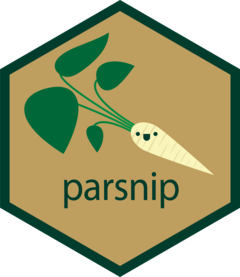

<!-- README.md is generated from README.Rmd. Please edit that file -->

# parsnip <a href="https://parsnip.tidymodels.org/"></a>

<!-- badges: start -->

[](https://github.com/tidymodels/parsnip/actions/workflows/R-CMD-check.yaml)
[](https://app.codecov.io/gh/tidymodels/parsnip?branch=main)
[](https://CRAN.R-project.org/package=parsnip)
[](https://CRAN.R-project.org/package=parsnip)
[](https://lifecycle.r-lib.org/articles/stages.html)
[](https://app.codecov.io/gh/tidymodels/parsnip)
<!-- badges: end -->

## Introduction

The goal of parsnip is to provide a tidy, unified interface to models
that can be used to try a range of models without getting bogged down in
the syntactical minutiae of the underlying packages.

## Installation

``` r
# The easiest way to get parsnip is to install all of tidymodels:
install.packages("tidymodels")

# Alternatively, install just parsnip:
install.packages("parsnip")

# Or the development version from GitHub:
# install.packages("pak")
pak::pak("tidymodels/parsnip")
```

## Getting started

One challenge with different modeling functions available in R *that do
the same thing* is that they can have different interfaces and
arguments. For example, to fit a random forest regression model, we
might have:

``` r
# From randomForest
rf_1 <- randomForest(
  y ~ ., 
  data = dat, 
  mtry = 10, 
  ntree = 2000, 
  importance = TRUE
)

# From ranger
rf_2 <- ranger(
  y ~ ., 
  data = dat, 
  mtry = 10, 
  num.trees = 2000, 
  importance = "impurity"
)

# From sparklyr
rf_3 <- ml_random_forest(
  dat, 
  intercept = FALSE, 
  response = "y", 
  features = names(dat)[names(dat) != "y"], 
  col.sample.rate = 10,
  num.trees = 2000
)
```

Note that the model syntax can be very different and that the argument
names (and formats) are also different. This is a pain if you switch
between implementations.

In this example:

- the **type** of model is “random forest”,
- the **mode** of the model is “regression” (as opposed to
  classification, etc), and
- the computational **engine** is the name of the R package.

The goals of parsnip are to:

- Separate the definition of a model from its evaluation.
- Decouple the model specification from the implementation (whether the
  implementation is in R, spark, or something else). For example, the
  user would call `rand_forest` instead of `ranger::ranger` or other
  specific packages.
- Harmonize argument names (e.g. `n.trees`, `ntrees`, `trees`) so that
  users only need to remember a single name. This will help *across*
  model types too so that `trees` will be the same argument across
  random forest as well as boosting or bagging.

Using the example above, the parsnip approach would be:

``` r
library(parsnip)

rand_forest(mtry = 10, trees = 2000) |>
  set_engine("ranger", importance = "impurity") |>
  set_mode("regression")
#> Random Forest Model Specification (regression)
#> 
#> Main Arguments:
#>   mtry = 10
#>   trees = 2000
#> 
#> Engine-Specific Arguments:
#>   importance = impurity
#> 
#> Computational engine: ranger
```

The engine can be easily changed. To use Spark, the change is
straightforward:

``` r
rand_forest(mtry = 10, trees = 2000) |>
  set_engine("spark") |>
  set_mode("regression")
#> Random Forest Model Specification (regression)
#> 
#> Main Arguments:
#>   mtry = 10
#>   trees = 2000
#> 
#> Computational engine: spark
```

Either one of these model specifications can be fit in the same way:

``` r
set.seed(192)
rand_forest(mtry = 10, trees = 2000) |>
  set_engine("ranger", importance = "impurity") |>
  set_mode("regression") |>
  fit(mpg ~ ., data = mtcars)
#> parsnip model object
#> 
#> Ranger result
#> 
#> Call:
#>  ranger::ranger(x = maybe_data_frame(x), y = y, mtry = min_cols(~10,      x), num.trees = ~2000, importance = ~"impurity", num.threads = 1,      verbose = FALSE, seed = sample.int(10^5, 1)) 
#> 
#> Type:                             Regression 
#> Number of trees:                  2000 
#> Sample size:                      32 
#> Number of independent variables:  10 
#> Mtry:                             10 
#> Target node size:                 5 
#> Variable importance mode:         impurity 
#> Splitrule:                        variance 
#> OOB prediction error (MSE):       5.976917 
#> R squared (OOB):                  0.8354559
```

A list of all parsnip models across different CRAN packages can be found
at <https://www.tidymodels.org/find/parsnip/>.

## Contributing

This project is released with a [Contributor Code of
Conduct](https://contributor-covenant.org/version/2/0/CODE_OF_CONDUCT.html).
By contributing to this project, you agree to abide by its terms.

- For questions and discussions about tidymodels packages, modeling, and
  machine learning, please [post on RStudio
  Community](https://forum.posit.co/new-topic?category_id=15&tags=tidymodels,question).

- If you think you have encountered a bug, please [submit an
  issue](https://github.com/tidymodels/parsnip/issues).

- Either way, learn how to create and share a
  [reprex](https://reprex.tidyverse.org/articles/articles/learn-reprex.html)
  (a minimal, reproducible example), to clearly communicate about your
  code.

- Check out further details on [contributing guidelines for tidymodels
  packages](https://www.tidymodels.org/contribute/) and [how to get
  help](https://www.tidymodels.org/help/).
